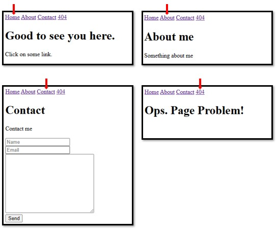

# Single Page Application (SPA) - Project 14

Project developed during the Rocketseat Course, Explorer Program, Class 06, Challenge Stage 05, in Feb/23.
Applying the concepts of Single Page Application (SPA).

🔗 [Click here to access](https://renato-albuquerque.github.io/spa-project14-explorer/)

## Technologies

- HTML
- CSS
- JavaScript
- Git e Github

## Contacts

🔗 [Linkedin](https://www.linkedin.com/in/renato-malbuquerque/)
🔗 [Business Card](https://rma-contacts.vercel.app/)